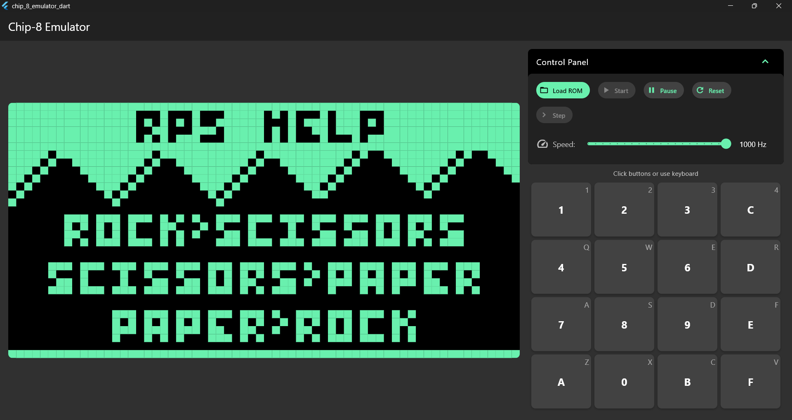
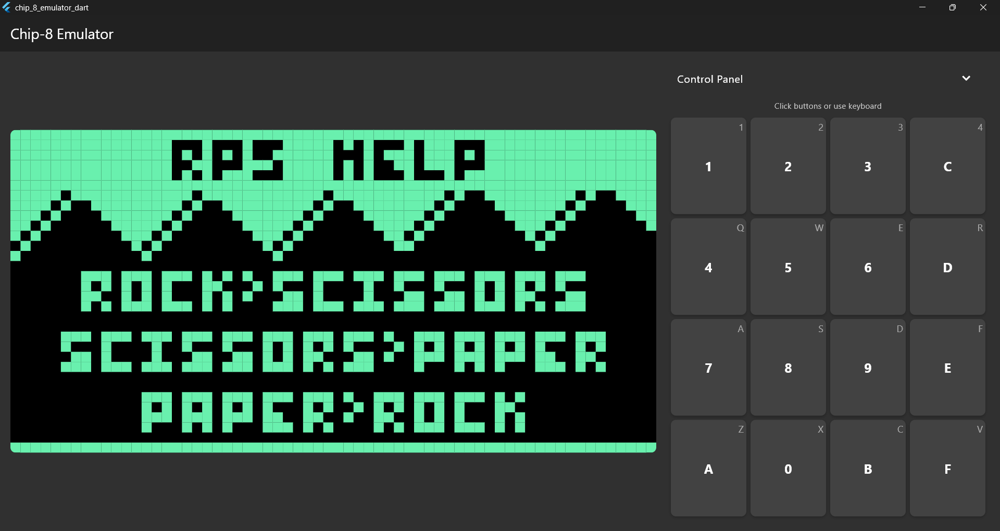
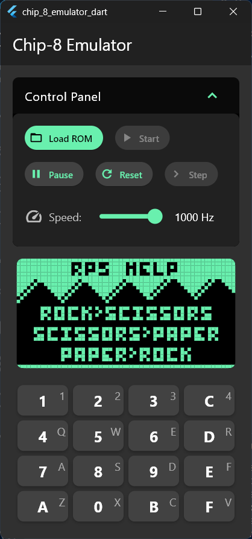
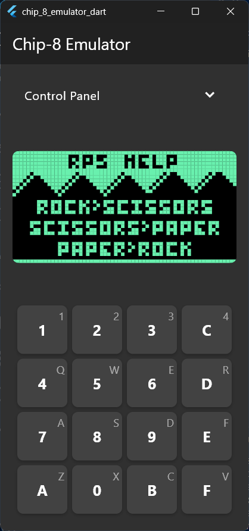
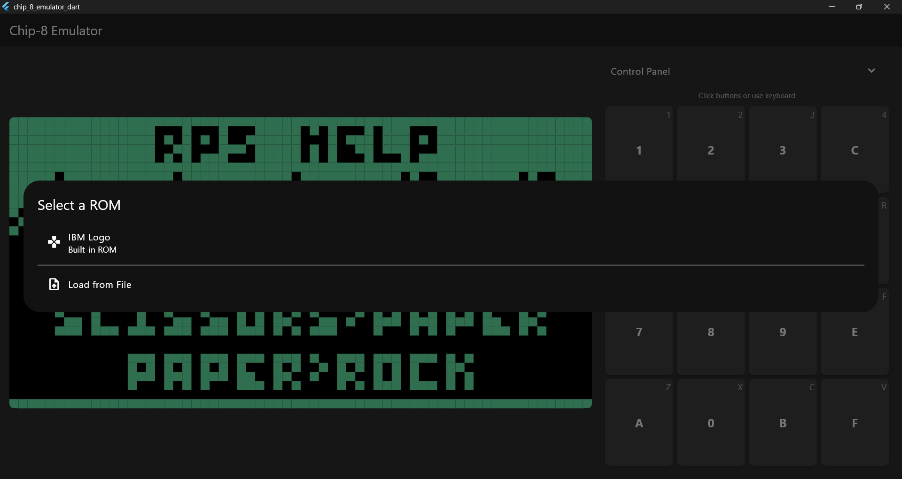

# CHIP-8 Emulator in Flutter

A comprehensive, high-performance CHIP-8 emulator built using Flutter. This project offers a fully functional emulator for running classic CHIP-8 ROMs, paired with an intuitive and responsive user interface.
NOTE: This readme is generated through LLM (ChatGPT)

---

## Table of Contents

* [Overview](#overview)
* [Features](#features)
* [Screenshots](#screenshots)
* [Technical Background](#technical-background)
* [Project Architecture](#project-architecture)
* [Implementation Details](#implementation-details)
* [User Guide](#user-guide)
* [Keyboard Mapping](#keyboard-mapping)
* [Development and Debugging](#development-and-debugging)
* [ROM Compatibility](#rom-compatibility)
* [Getting Started](#getting-started)
* [Performance Considerations](#performance-considerations)
* [Future Enhancements](#future-enhancements)
* [Contributing](#contributing)
* [Acknowledgements](#acknowledgements)

---

## Overview

CHIP-8 is an interpreted programming language developed in the 1970s to simplify game development on microcomputers. This emulator replicates that virtual machine using Flutter, making classic CHIP-8 games playable on modern devices.

---

## Features

* **Complete Instruction Set**: All 35 original CHIP-8 opcodes fully implemented.
* **Graphics**: 64×32 monochrome display with optional color customization.
* **Emulation Speed**: Adjustable between 60Hz and 1000Hz.
* **Advanced Input**:

  * On-screen keypad
  * Full keyboard integration with key mapping
* **Emulation Controls**:

  * Play/Pause
  * Step-by-step execution
  * Full system reset
  * Clock speed slider
* **Sound Support**: Emulates CHIP-8 sound timer.
* **ROM Management**:

  * Load built-in or custom ROMs
  * Memory inspection
* **Responsive UI**: Portrait and landscape support
* **Error Handling**: Clear and informative messages
* **Performance Metrics**: FPS and runtime indicators

---

## Screenshots

## Screenshots

<p align="center">
  
  
</p>

<p align="center"><strong>Landscape Mode</strong> - Optimized for gameplay</p>

<p align="center">
  
  
</p>

<p align="center"><strong>Portrait Mode</strong> - Mobile-friendly interface</p>

<p align="center">
  
</p>

<p align="center"><strong>ROM Selector</strong> - Easy ROM loading</p>


---

## Technical Background

CHIP-8 specs:

* Memory: 4KB
* Display: 64×32 pixels
* Registers: V0-VF, Index register (I)
* Stack: 16 levels
* Timers: Delay and Sound (60Hz)
* Input: 16-key hex keypad
* Sound: Simple beep

---

## Project Architecture

**Core Layer:**

* `chip_8.dart`: Orchestrates emulation
* `memory.dart`: 4KB memory
* `cpu.dart`: Opcode cycle and instruction execution
* `chip_display.dart`: Pixel buffer
* `keyboard.dart`: Input management
* `registers.dart`: V0–VF, I
* `chip_stack.dart`: Subroutine stack
* `timers.dart`: Delay and sound timers

**UI Layer:**

* `emulator_screen.dart`: Main interface
* `emulator_viewmodel.dart`: Binds UI with emulator logic
* `display_widget.dart`: Uses CustomPainter
* `keyboard_widget.dart`: Virtual/physical input
* `control_panel_widget.dart`: ROM loader & speed control

**Data Flow:**
User Input → ViewModel → Chip8.keyboard → CPU → Display → UI

---

## Implementation Details

### Memory

Memory split:

* `0x000–0x1FF`: Interpreter reserved
* `0x050–0x0A0`: Fontset
* `0x200–0xFFF`: ROM + work RAM

### CPU

Each opcode is decoded and dispatched to appropriate logic.

### Display

64×32 boolean array rendered via CustomPainter.

### Timers

Timers tick at 60Hz using `Timer.periodic`.

### Emulation Loop

Runs with a user-defined interval based on clock speed.

---

## User Guide

### Getting Started

1. Launch app
2. Load a ROM (built-in or custom)
3. Press **Start** to begin
4. Use on-screen or keyboard inputs

### Controls

* **Start/Pause/Reset/Step**
* **Speed Slider**: 60Hz–1000Hz

### ROM Loading

* Choose from built-in or import your own

### Tips

* Landscape mode preferred
* Use 300–500Hz for most games
* Use Step mode to debug frozen ROMs

---

## Keyboard Mapping

CHIP-8 Keypad:

```
1 2 3 C
4 5 6 D
7 8 9 E
A 0 B F
```

Mapped to:

```
1 2 3 4
Q W E R
A S D F
Z X C V
```

---

## Development and Debugging

* **Step Mode**: Debug one instruction at a time
* **Error Messages**: Shown on opcode, ROM, and stack errors
* **State Inspection**: Check memory, registers, stack manually

---

## ROM Compatibility

Supports most standard CHIP-8 ROMs:

* Pong
* Space Invaders
* Tetris
* Breakout
* Maze, etc.

Extended SUPER-CHIP ROMs may not work fully.

---

## Getting Started

### Prerequisites

* Flutter 3.0+
* Dart 2.17+

### Installation

```bash
git clone https://github.com/Vinayak360/chip_8_emulator.git
cd chip_8_emulator_dart
flutter pub get
flutter run
```

### Building

```bash
flutter build apk --release       # Android
flutter build ios --release       # iOS
flutter build web --release       # Web
flutter build windows --release   # Windows
```

---

## Performance Considerations

* **60–200Hz**: Slower puzzle games
* **300–500Hz**: Recommended
* **600–1000Hz**: Fast-action games or speedruns

Low memory (<30MB) and CPU usage (<5%).

---

## Future Enhancements

* SUPER-CHIP support (128×64 resolution)
* Save/load emulation state
* Custom key mapping
* Debugger with memory viewer
* Game preview library
* Advanced sound controls
* Screenshots & recording support

---

## Contributing

1. Fork the repo
2. Create a feature branch
3. Commit changes
4. Push and open PR

### Guidelines

* Follow code conventions
* Comment complex logic
* Update documentation


---

## Acknowledgements

* Joseph Weisbecker – Creator of CHIP-8
* [CHIP-8 technical reference community](https://tobiasvl.github.io/blog/write-a-chip-8-emulator/)
* [CHIP-8 ROM archives](https://johnearnest.github.io/chip8Archive/)
* [Open-source emulator implementations](https://en.wikipedia.org/wiki/CHIP-8)
* [All contributors and testers](https://multigesture.net/articles/how-to-write-an-emulator-chip-8-interpreter/)
